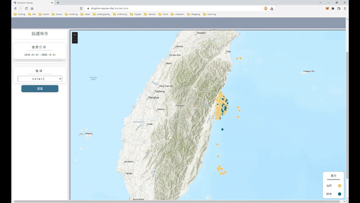
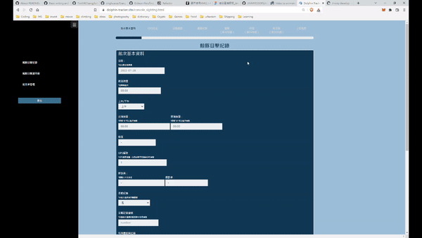

# Dolphin_tracker
This is a collaborative project with Kuroshio Ocean Education Foundation, a NGO whom concerns Taiwan's ocean 
environment and ocean culture, to digitize dolphin and whale sighting documentations and raising awareness of Taiwan's ocean environment.

## The Website - start and get to know your fellow ocean neighbours

Website URL: https://www.dolphin-tracker.site/

Website administrator console: https://www.dolphin-tracker.site/admin/console

Testing account

- Testing account: test@email.com
- Password: test

Note: the testing account will not be allowed to export the database. 

## System Structure

## Database Schema

## Features
- Front-End 
    - Search for digitized dolphin and whale sight records 
    Sighting records are contucted by Kuroshio Ocean Education Foundation, where recorders aboard whale watching tour boats and departure from Port of Hualien.
        - Users can filter according to date and type of dolphin and whales
        - Users can click on data points to view sighting records

    
    - Viewing common dolphin and whale in Taiwan 

- Content Management System
    - Create sighting records including images
    - View, update and export database records
    - User privilage management 

    

## Running the project 
Set GitHub Action environment secrets according to .env file, easingthemes/ssh-deploy@main and appleboy/ssh-action@master guideance and setup database according to SQL dump file. 

## Sighting records data pipeline  
Sighting Documents should be converted to utf 16 encoded csv files running node ./utils/createsightdata.js which 
saves the results the data base.

## Technologies
- Front-End: JavaScript, HTML, CSS, Jquery   
- Back-End: Node.js, Express.js, Linux, Nginx, cheerio
- Database: MySQL
- Cloud Service(AWS): EC2, RDS, S3, CloudFront
- Third Party API: Esri ArcGIS API
- CI/CD: GitHub Actions
- Test: Jest, Supertest
- Container: Docker
